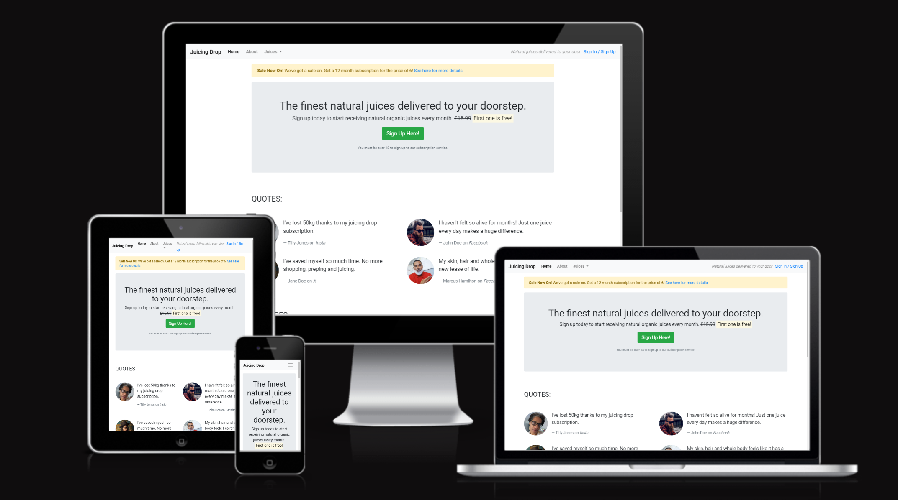

Welcome,

This is the Code Institute student walk through project. It was originally a mobile-first, responsive landing page to promote a whiskey subscription service. I changed it into a service to promote natural organic juices.

This is my first time using bootstrap and the training went through how to create a basic website with additional css and styling but I prefer websites with minimal css and styling so added to the completed basic website.

Now that I have used bootstrap I can see that it is not another language but more an easy way to add css and html to create a website.

I will be learning more about bootstrap via their [documentation](https://blog.getbootstrap.com/) and [blog](https://blog.getbootstrap.com/)
